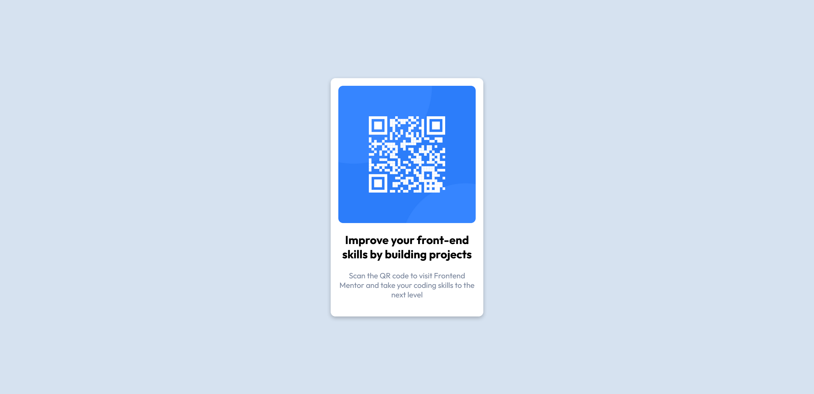
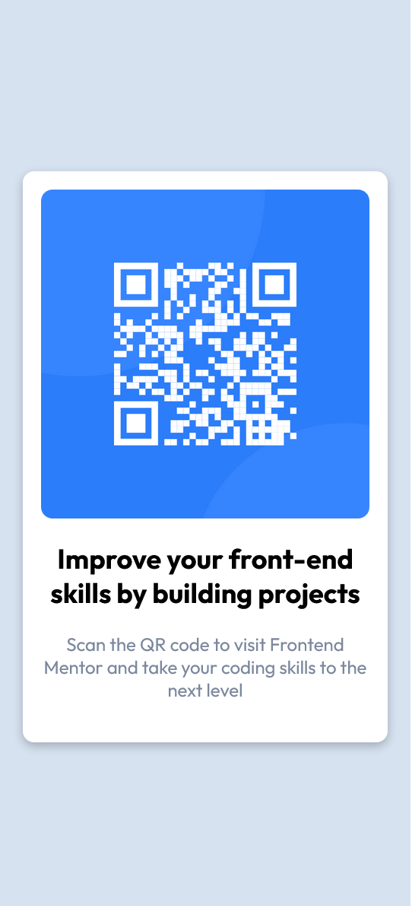

# Frontend Mentor - QR code component solution

## Live Site URL: [https://qr-component-sriveer.netlify.app/](https://qr-component-sriveer.netlify.app/)
## Website: [https://veeru-portfolio.netlify.app/](https://veeru-portfolio.netlify.app/)
## LinkedIn: [https://www.linkedin.com/in/sriveer-neerukonda-4a3465272](https://www.linkedin.com/in/sriveer-neerukonda-4a3465272)
## Twitter: [https://twitter.com/sriveerN](https://twitter.com/sriveerN)

This is a solution to the [QR code component challenge on Frontend Mentor](https://www.frontendmentor.io/challenges/qr-code-component-iux_sIO_H).